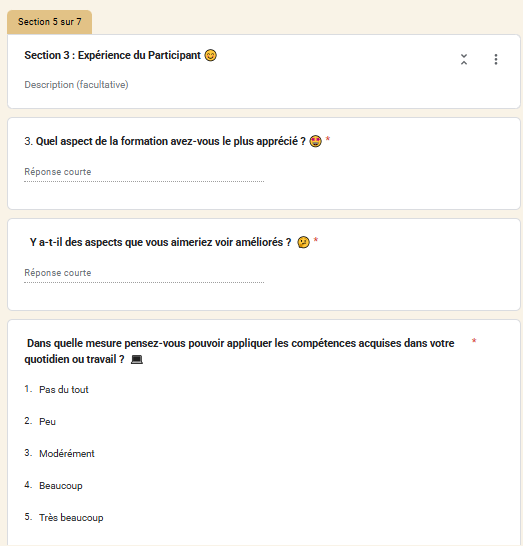

# 📥 Phase 1 – Collecte des données (Google Forms)

La première étape du pipeline consiste à **collecter les données à la source** via des formulaires en ligne.  
BubbleTech utilisait initialement des inscriptions informelles ou des fichiers Excel épars. Nous avons professionnalisé ce processus en créant **des formulaires Google Forms structurés**, adaptés aux différentes typologies d’acteurs.

---

## 🎯 Objectifs de la collecte

- Uniformiser la collecte des données en ligne
- Rendre la saisie plus simple pour les utilisateurs
- Préparer les données pour un traitement automatisé (via Google Sheets)
- Aligner les questions avec les KPIs définis dans la stratégie analytique

---

## 📋 Formulaires créés

Au total, **8 formulaires** ont été conçus et diffusés :

1. **Bénéficiaires de formation**
2. **Stagiaires**
3. **Bénévoles**
4. **Formateurs**
5. **Employés**
6. **Partenaires**
7. **Satisfaction post-formation**
8. **Feedback après passage chez BubbleTech**

Chaque formulaire a été structuré sur base des indicateurs attendus pour l’analyse et la visualisation. Les questions ont été validées avec les équipes concernées (administration, accompagnement, formation, direction).

---

## 🔐 Respect de la confidentialité (RGPD)

Chaque formulaire commence par une section de consentement expliquant la finalité de la collecte, les droits des utilisateurs et la durée de conservation des données, en conformité avec le **Règlement Général sur la Protection des Données (RGPD)**.

> 📸 Exemple : introduction RGPD dans le formulaire stagiaire

---

## 🧠 Structure des questions

Les formulaires combinent :
- des champs quantitatifs (échelles de satisfaction, scores, menus déroulants)
- des champs qualitatifs (réponses libres)
- des champs d’identification structurés (nom, email, téléphone...)

> 📸 Exemple : évaluation des formations (notation par étoiles)

> 📸 Exemple : questions ouvertes et échelle d’impact

.

---

## 🔗 Outils et formats utilisés

- **Google Forms** pour la saisie structurée
- **Google Sheets** pour la centralisation automatique des réponses
- Chaque réponse est automatiquement enregistrée dans un tableur dédié par formulaire

---

## 📌 Conclusion

Cette phase a permis de poser une base fiable et exploitable pour tout le reste du pipeline analytique.  
Les données collectées sont prêtes à être **traitées automatiquement** dans l’étape suivante : le **prétraitement Python (ETL)**.
