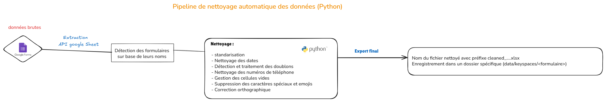
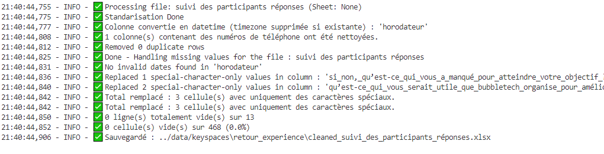

# 🧼 Phase 2 – Pipeline de nettoyage automatique des données (Python)

Cette phase consiste à **prétraiter automatiquement les fichiers bruts issus de Google Forms**, centralisés dans Google Sheets.  
L’objectif est d’obtenir des fichiers propres, cohérents, et exploitables pour leur insertion dans une base de données NoSQL ou relationnelle.

Un script Python personnalisé, nommé **`data_cleaning.py`**, a été développé pour automatiser cette opération de bout en bout.

---

## ⚙️ Fonctionnement du pipeline

### 🔁 Étapes du traitement

1. **Détection du type de formulaire**  
   → basée sur le nom du fichier

2. **Standardisation des noms de colonnes**  
   → suppression des majuscules, accents, caractères spéciaux, renommage via un mapping (`column_mappings.py`)

3. **Nettoyage du contenu**  
   - Dates (conversion et validation)
   - Téléphones (standardisation au format belge)
   - Doublons (suppression)
   - Champs vides (ligne/colonne)
   - Cellules avec caractères spéciaux ou emojis
   - Correction orthographique (textes libres)

4. **Export final**
   - Nom du fichier : `cleaned_<nom_formulaire>.xlsx`
   - Dossier de sortie : `data/keyspaces/<nom_du_formulaire>`

---

## 🧼 Détail des nettoyages appliqués

- 🔡 Standardisation des noms de colonnes  
- 🗓 Nettoyage et conversion des dates (avec timezone supprimée)  
- 📞 Normalisation des numéros de téléphone (avec regex)  
- ♻️ Détection et suppression des doublons  
- 🧼 Suppression des lignes entièrement vides  
- ✂️ Nettoyage des caractères spéciaux, emojis, cellules parasites  
- 🧠 Correction automatique des fautes d’orthographe (via `pyspellchecker`)

---

## 📁 Fichiers impliqués

- `data_cleaning.py` → script principal
- `column_mappings.py` → dictionnaire de mapping des colonnes
- Fichiers sources : `.xlsx` ou `.csv` issus de Google Sheets
- Fichiers nettoyés : `cleaned_*.xlsx` dans `/data/keyspaces/`

---

## 🖼️ Schéma du pipeline

Ce schéma résume les étapes clés de ce pipeline automatisé :

---

## 📸 Exemple d’exécution (log réel)

> Voici un aperçu d’un traitement réalisé sur le fichier `suivi des participants réponses` :

---

## ✅ Résultat attendu

- Des fichiers nettoyés, cohérents, et prêts à être insérés dans Cassandra ou PostgreSQL
- Une traçabilité complète des modifications
- Un gain de temps important et une réduction des erreurs humaines

---

> Cette phase garantit un **haut niveau de qualité et de fiabilité des données** tout en automatisant une tâche critique du pipeline analytique.
