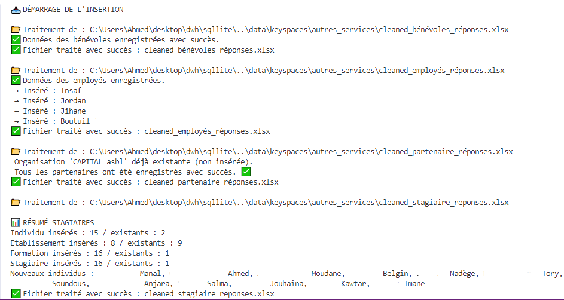
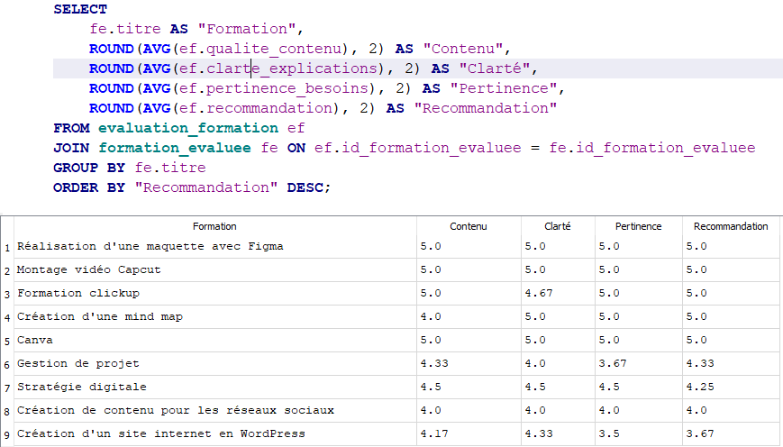

# 🧩 Phase 4 – Intégration relationnelle dans PostgreSQL

Cette phase consiste à insérer les données nettoyées dans une base PostgreSQL structurée, normalisée et évolutive.  
Elle constitue le **socle du système décisionnel** de BubbleTech, connectée ensuite à Power BI pour la restitution.

---

## 🎯 Pourquoi PostgreSQL ?

- Moteur SQL robuste et open source  
- Intégrité relationnelle et contraintes de cohérence  
- Support des requêtes analytiques avancées  
- Connectivité avec les outils BI (Power BI, Metabase, etc.)

---

## 🧱 Modèle relationnel

Le modèle est structuré autour de la table centrale `individu`, liée à des rôles (`stagiaire`, `formateur`, `bénévole`, etc.) et à différentes entités d'interaction (satisfaction, organisation, disponibilité...).


### 📌 Volet 1 – Modèle relationnel : Individus & Rôles


Ce schéma représente le **cœur de la base de données** : la table `individu`, dans laquelle toutes les personnes sont enregistrées avec leurs informations générales (nom, email, âge, genre, nationalité...).

Chaque individu peut occuper un ou plusieurs **rôles** : stagiaire, bénévole, employé ou formateur.  
Ces rôles sont enregistrés dans une table `role`, liée à un `type_role` (`stagiaire`, `bénévole`, etc.).  
Chaque rôle est ensuite **spécialisé dans une table métier dédiée** qui contient des colonnes propres à ce profil.

Le modèle intègre également :
- les **langues parlées** (`individu_langue`)
- le **niveau d’étude** (`niveau_etude`)
- le **statut professionnel** (`experience`)
- les **disponibilités** d’un individu (jours et horaires préférés)
- les **préférences de travail** pour les employés (type de contrat, domaine, horaires)

Il s’agit d’un modèle flexible qui permet d’**ajouter de nouveaux rôles** ou attributs sans modifier la table `individu`.


### 🧾 Vue d’ensemble des tables du Volet 1

| Table                   | Description                                                       | Liée à                           |
|-------------------------|-------------------------------------------------------------------|----------------------------------|
| `individu`              | Personne unique avec ses informations générales                  | `role`, `experience`, `niveau_etude`, `individu_langue` |
| `role`                  | Association entre un individu et un rôle                         | `type_role`, `stagiaire`, `benevole`, `formateur`, `employe` |
| `type_role`             | Contient les types de rôles (stagiaire, bénévole...)             | `role`                           |
| `stagiaire`, `formateur`, `benevole`, `employe` | Tables métiers spécifiques contenant les infos propres au rôle | `role`        |
| `experience`            | Statut professionnel et expérience globale                       | `individu`                       |
| `niveau_etude`          | Dernier niveau d’étude complété                                  | `individu`                       |
| `individu_langue`       | Langues parlées par l’individu                                   | `langue`, `individu`             |
| `disponibilite`         | Jours et horaires où une personne est disponible                 | `role`, `jour`, `horaire`        |
| `preference_travail`    | Préférences d’un employé (mode, domaine, horaire)                | `employe`, `mode_travail`        |
| `mode_travail`          | Modalité de travail souhaitée (présentiel, télétravail...)       | `preference_travail`             |
| `jour` / `horaire`      | Tables de référence pour les créneaux disponibles                | `disponibilite`                  |

### 🔗 Relations clés du Volet 1

| Relation                          | Description                                                            |
|-----------------------------------|------------------------------------------------------------------------|
| `individu` 🔁 `role`              | Un individu peut avoir plusieurs rôles                                 |
| `role` 🔁 `type_role`             | Chaque rôle a un type défini (stagiaire, formateur…)                   |
| `role` 🔁 `stagiaire` (etc.)      | Chaque rôle se spécialise dans une table dédiée                        |
| `individu` 🔁 `niveau_etude`      | Une personne est liée à son niveau d’étude                             |
| `individu` 🔁 `experience`        | Une personne est liée à son expérience pro                             |
| `individu` 🔁 `individu_langue`   | Association avec une ou plusieurs langues parlées                      |
| `role` 🔁 `disponibilite`         | Disponibilités liées au rôle (pour stage, bénévolat…)                  |
| `disponibilite` 🔁 `jour`/`horaire` | Disponibilités précises en jour et créneau horaire                    |
| `employe` 🔁 `preference_travail` | L’employé exprime des préférences de travail (temps partiel, domaine) |
| `preference_travail` 🔁 `mode_travail` | Modalité de travail préférée                                       |

---

### 📌 Volet 2 – Modèle relationnel : Inscriptions & Formations

Ce schéma illustre le processus d’inscription d’un individu à une formation organisée par BubbleTech.  
Lors de l’inscription, plusieurs dimensions sont enregistrées :

- La **formation souhaitée** (`formation_bubbletech`)
- Les **objectifs pédagogiques exprimés** (`objectif_formation`)
- Le **format préféré** (ex : en ligne, en présentiel)
- Le ou les **créneaux horaires** souhaités
- Le **niveau d’étude** et **l’expérience professionnelle**
- L’établissement d’origine

Chaque inscription est donc **personnalisée** selon le profil du participant, ses attentes et ses contraintes.  
Ce modèle permet à BubbleTech d’orienter les offres selon les besoins réels des inscrits.


### 🧾 Vue d’ensemble des tables du Volet 2

| Table                   | Description                                                        | Liée à                        |
|-------------------------|--------------------------------------------------------------------|-------------------------------|
| `individu`              | Personne inscrite                                                  | `inscription_formation`       |
| `formation_bubbletech`  | Formation proposée                                                 | `inscription_formation`       |
| `inscription_formation` | Inscription d’un individu à une formation                          | `individu`, `formation_bubbletech` |
| `objectif_formation`    | Objectif exprimé par le participant                                | `inscription_objectif`        |
| `inscription_objectif`  | Table de liaison entre une inscription et un ou plusieurs objectifs | `inscription_formation`       |
| `format`                | Format préféré de la formation (ex : hybride, présentiel...)       | `inscription_format`          |
| `inscription_format`    | Table de liaison entre inscription et format                       | `format`, `inscription_formation` |
| `horaire_preference`    | Créneau horaire souhaité                                            | `inscription_horaire`         |
| `inscription_horaire`   | Liaison entre inscription et horaire                               | `inscription_formation`       |
| `etablissement`         | Établissement d’origine                                            | `formation`                   |
| `niveau_etude`          | Dernier niveau d’étude complété                                    | `individu`                    |
| `experience`            | Statut professionnel et secteur                                    | `individu`                    |


### 🔗 Relations clés du Volet 2

| Relation                                          | Description                                                             |
|---------------------------------------------------|-------------------------------------------------------------------------|
| `individu` 🔁 `inscription_formation`             | Un individu peut s’inscrire à plusieurs formations                     |
| `inscription_formation` 🔁 `formation_bubbletech` | Chaque inscription est liée à une formation cible                      |
| `inscription_formation` 🔁 `inscription_objectif` | Objectifs exprimés par le participant lors de l’inscription            |
| `inscription_objectif` 🔁 `objectif_formation`    | Objectifs pédagogiques (ex : maîtriser Excel, apprendre à coder...)   |
| `inscription_formation` 🔁 `inscription_format`   | Préférence sur le format de la formation                               |
| `inscription_format` 🔁 `format`                  | Format spécifique (présentiel, distanciel...)                          |
| `inscription_formation` 🔁 `inscription_horaire`  | Créneaux horaires préférés                                             |
| `inscription_horaire` 🔁 `horaire_preference`     | Détail du créneau horaire                                              |


---

### 📌 Volet 3 – Modèle relationnel : Partenariats

Ce schéma présente le modèle de gestion des partenariats chez BubbleTech.  
Chaque **organisation** (entreprise, asbl, institution...) est enregistrée dans la table `organisation`.

Lorsqu’un partenariat est créé avec une organisation, la table `partenariat` centralise les informations suivantes :
- Objectifs de collaboration
- Public ciblé
- Domaines d’intervention
- Ressources à partager
- Fréquence de disponibilité
- Disponibilités horaires (créneaux)

Les différents attributs du partenariat sont modélisés sous forme de **tables de liaison** afin d’assurer une flexibilité totale.  
Par exemple, un partenariat peut :
- avoir **plusieurs types** (ex : soutien logistique, communication)
- s’exercer dans plusieurs **formats** (ex : en ligne, sur place)
- concerner plusieurs **ressources** ou **domaines de collaboration**


### 🧾 Vue d’ensemble des tables du Volet 3

| Table                   | Description                                                       | Liée à                       |
|-------------------------|-------------------------------------------------------------------|------------------------------|
| `organisation`          | Informations sur l'entité partenaire                             | `partenariat`                |
| `partenariat`           | Données principales sur la collaboration                         | `organisation`               |
| `partenariat_metadata`  | Informations complémentaires : source, consentement              | `partenariat`                |
| `type_partenariat`      | Types possibles (ex : financier, pédagogique, communication)      | `partenariat_type`           |
| `partenariat_type`      | Table de liaison entre partenariat et type(s)                    | `partenariat`, `type_partenariat` |
| `format_collaboration`  | Exemples : en ligne, en présentiel                                | `partenariat_format`         |
| `partenariat_format`    | Table de liaison avec les formats proposés                        | `partenariat`, `format_collaboration` |
| `domaine_organisation`  | Domaines d’action de l’organisation                               | `partenariat_domaine`        |
| `partenariat_domaine`   | Liaison entre un partenariat et ses domaines                      | `partenariat`, `domaine_organisation` |
| `ressource_partagee`    | Ressources mises à disposition par l'organisation                | `partenariat_ressource`      |
| `partenariat_ressource` | Liaison entre un partenariat et ses ressources                    | `partenariat`, `ressource_partagee` |
| `horaire_partenaire`    | Créneaux de disponibilité du partenaire                           | `disponibilite_partenaire`   |
| `disponibilite_partenaire` | Table de liaison avec les horaires disponibles                 | `partenariat`, `horaire_partenaire` |


### 🔗 Relations clés du Volet 3

| Relation                                      | Description                                                     |
|-----------------------------------------------|-----------------------------------------------------------------|
| `organisation` 🔁 `partenariat`              | Une organisation peut avoir un ou plusieurs partenariats       |
| `partenariat` 🔁 `partenariat_metadata`      | Infos complémentaires sur le partenariat                       |
| `partenariat` 🔁 `partenariat_type` 🔁 `type_partenariat` | Un partenariat peut avoir plusieurs types                      |
| `partenariat` 🔁 `partenariat_format` 🔁 `format_collaboration` | Plusieurs formats sont possibles (présentiel, en ligne) |
| `partenariat` 🔁 `partenariat_domaine` 🔁 `domaine_organisation` | Domaines d’expertise ou de contribution                       |
| `partenariat` 🔁 `partenariat_ressource` 🔁 `ressource_partagee` | Ressources partagées (locaux, matériel, accompagnement)       |
| `partenariat` 🔁 `disponibilite_partenaire` 🔁 `horaire_partenaire` | Jours/horaires disponibles pour intervenir ou contribuer       |
---

### 🧾 Vue d’ensemble des tables principales

| Table                      | Description                                              | Liée à                   |
|----------------------------|----------------------------------------------------------|---------------------------|
| `individu`                | Personne unique (nom, contact, etc.)                    | `role`, `satisfaction`, `experience` |
| `role`                    | Décrit le rôle d’un individu                            | `type_role`, tables spécifiques       |
| `type_role`               | Contient les types de rôles (stagiaire, bénévole...)   | `role`                    |
| `stagiaire`, `formateur`…| Détails spécifiques selon le rôle                       | `role`                    |
| `formation_evaluee`      | Formation suivie par un individu                        | `individu`, `evaluation_formation` |
| `evaluation_formation`   | Retour qualitatif sur une formation                     | `formation_evaluee`, `individu` |
| `partenaire`, `employe`  | Liens avec une organisation                             | `individu`, `organisation` |
| `organisation`           | Donne des infos sur les partenaires institutionnels     | `partenaire`, `employe` |


---

## 🧑‍💻 Organisation des scripts d’insertion Python

```bash
├── push_db.py                # Lance tous les handlers
├── db.py                     # Connexion + création tables
├── utils.py                  # Fonctions communes
└── forms/
    ├── stagiaire.py
    ├── formateur.py
    ├── benevole.py
    ├── partenaire.py
    └── ...
```

---
## 📸 Exemple d’exécution (terminal)



---

## 🗂️ Exemple de contenu réel (table `individu`)


---

## 🧠 Analyse décisionnelle – Exemples de requêtes SQL

Ces requêtes montrent comment la base peut générer **des indicateurs utiles pour piloter les actions**.

---

### 🔍 Requête 1 : Disponibilités d’un stagiaire

```sql
SELECT i.nom_complet AS "Stagiaire", j.jour AS "Jour", h.tranche_horaire AS "Créneau"
FROM individu i
JOIN role r ON i.id_individu = r.id_individu
JOIN stagiaire st ON r.id_role = st.id_role
JOIN disponibilite d ON r.id_role = d.id_role
JOIN jour j ON d.id_jour = j.id_jour
JOIN horaire h ON d.id_horaire = h.id_horaire
WHERE i.nom_complet = 'OUDAOUDOUHMOU Ahmed';
```

📸 Résultat :


---

### 📊 Requête 2 : Formations les mieux perçues globalement  
Afficher la moyenne des évaluations par formation (contenu, clarté, pertinence, recommandation).

```sql
SELECT 
    fe.titre AS "Formation",
    ROUND(AVG(ef.qualite_contenu), 2) AS "Contenu",
    ROUND(AVG(ef.clarte_explications), 2) AS "Clarté",
    ROUND(AVG(ef.pertinence_besoins), 2) AS "Pertinence",
    ROUND(AVG(ef.recommandation), 2) AS "Recommandation"
FROM evaluation_formation ef
JOIN formation_evaluee fe ON ef.id_formation_evaluee = fe.id_formation_evaluee
GROUP BY fe.titre
ORDER BY "Recommandation" DESC;
```

📸 Résultat :



---

### 🏆 Requête 3 : Formation la mieux notée  
Identifier la formation ayant obtenu la meilleure note de recommandation.

```sql
SELECT fe.titre AS titre_formation, 
       ROUND(AVG(ef.recommandation), 2) AS moyenne_recommandation
FROM evaluation_formation ef
JOIN formation_evaluee fe ON ef.id_formation_evaluee = fe.id_formation_evaluee
GROUP BY fe.titre
ORDER BY moyenne_recommandation DESC
LIMIT 1;
```

📸 Résultat :


---

## 📌 Conclusion

Cette phase a permis de transformer les données brutes en un **modèle structuré, cohérent et exploitable**, capable de générer des indicateurs stratégiques.  
Grâce à cette base relationnelle, BubbleTech peut aujourd’hui :

- analyser la qualité de ses formations,  
- suivre les profils de ses bénéficiaires,  
- évaluer l’engagement de ses partenaires et bénévoles,  
- et piloter ses décisions sur des bases solides.

🎯 C’est le cœur du système décisionnel mis en œuvre dans ce projet.
