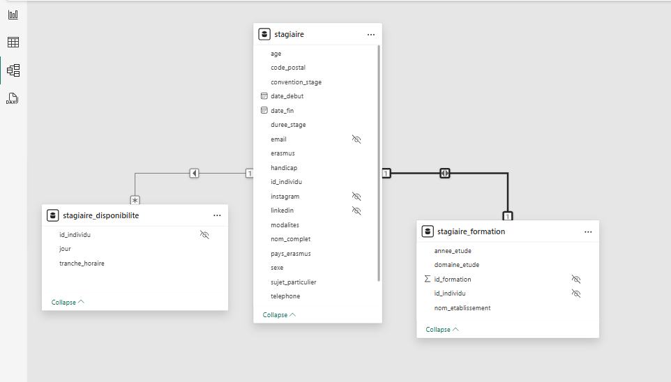

# 📊 Dashboards Power BI – Projet BubbleTech

## 🎯 Objectifs du rapport Power BI

La direction de BubbleTech exprimait un besoin clair : disposer d’une **vision consolidée, fiable et interactive** sur ses activités.

Avant ce projet, les données étaient réparties dans plusieurs fichiers Excel. Il était difficile d’avoir une **vue d’ensemble rapide**, de suivre l’évolution des indicateurs clés, ou de comparer les profils des bénéficiaires.

Le rapport Power BI permet aujourd’hui de :
- Piloter l’activité des stagiaires, bénévoles, formateurs, partenaires,
- Visualiser la répartition des profils et des disponibilités,
- Analyser la satisfaction, les domaines de collaboration, et l’impact des actions,
- Suivre la qualité des données collectées pour assurer la fiabilité des décisions.

En résumé : ce rapport est un **outil d’aide à la décision**, pensé pour la direction, construit à partir de données terrain, et mis à jour en continu pour refléter la réalité de terrain.
---

## 🔗 Connexion à la base de données PostgreSQL

Le rapport Power BI est connecté à une base de données locale PostgreSQL (`localhost:5432`) contenant les vues SQL nécessaires à l’analyse.

La base `bubbletech_db` héberge un ensemble de vues préconstruites (ex. `vue_stagiaire`, `vue_partenaire`, `vue_satisfaction_globale`, etc.), déjà nettoyées, structurées, et prêtes à l’usage.

🛠️ Le mode de connexion utilisé est **Import**, ce qui permet de charger les données localement pour assurer des performances fluides, sans latence au filtrage ni à l’interaction.

📸 Exemple de connexion Power BI :


💡 Ce choix permet une **séparation claire des responsabilités** :
- Le nettoyage et la structuration sont faits en amont, dans la base,
- Power BI se concentre uniquement sur la modélisation, les mesures DAX, et la visualisation.

  ---

## 🧩 Modèle relationnel Power BI

Le rapport Power BI repose sur un **modèle relationnel clair et segmenté par rôle**, construit à partir de **vues SQL optimisées**.  
Chaque vue correspond à une entité métier : stagiaire, formateur, partenaire, etc., ce qui permet une lisibilité accrue, une meilleure performance et une maintenance facilitée.

---

### 🗂️ Exemple 1 : Vue Partenaire


La vue `partenaire` est reliée à plusieurs entités secondaires :
- `type` de partenariat
- `format` de collaboration
- `ressources partagées`
- `disponibilité horaire`
- `domaines d’intervention`

👉 Cette structuration permet de filtrer dynamiquement les partenariats selon différents critères.

---

### 🗂️ Exemple 2 : Vue Stagiaire



La table `Stagiaire` centralise toutes les informations liées au profil :  
âge, genre, modalités de stage, réseau social, etc.

Elle est reliée à deux tables :
- `stagiaire_disponibilite` : un stagiaire peut avoir plusieurs créneaux disponibles (relation 1:N)
- `stagiaire_formation` : chaque stagiaire est associé à une formation unique (relation 1:1 dans ce projet)

🔐 Certaines colonnes sensibles (linkedin, instagram…) ont volontairement été masquées dans le modèle pour illustrer la bonne gestion de la confidentialité dans le rapport.

---

### 🧠 Autres vues utilisées (non affichées ici) :

| Vue                     | Rôle couvert                    |
|--------------------------|---------------------------------|
| `formateur`              | Intervenants pédagogiques       |
| `employe`                | Équipe interne                  |
| `benevole`               | Profils engagés ponctuellement  |
| `satisfaction_globale`   | Résultats d’évaluation des formations |
| `mesures`                | Table centrale DAX (KPI)        |

---

🎯 Ce découpage en vues thématiques assure :
- Un modèle propre et modulaire
- Un filtrage logique (ex : 1 stagiaire ➝ plusieurs créneaux)
- Une séparation des responsabilités entre base de données et reporting

---
## 🧼 Nettoyage complémentaire via Power Query

La majorité du nettoyage a été réalisée en amont dans Python (standardisation, typage, unicité) et via les vues SQL optimisées.  
Power Query a donc été utilisé uniquement pour **finaliser la préparation analytique**, avec des transformations légères :

- ✂️ Suppression de colonnes inutiles à la visualisation
- 🧾 Renommage lisible de certains champs techniques
- 🔢 Changement de type de données (texte ➝ entier, date ➝ format court)
- 🧹 Élimination de valeurs nulles ponctuelles.
- ✅ Vérification de la cohérence avec les visuels DAX attendus

🎯 Power Query a servi ici comme **étape de validation métier** avant la modélisation dans Power BI.

---
## 🧠 Création des indicateurs (DAX)


Certains indicateurs clés du rapport Power BI nécessitent des calculs personnalisés, impossibles à générer directement via les visuels.  
Pour cela, des **mesures DAX** ont été créées, notamment pour l’analyse des retours de satisfaction.


### 🎯 1. Score global de satisfaction

Calcule une moyenne pondérée des 4 critères principaux (contenu, clarté, pertinence, recommandation).

```dax
Score_Global_Satisfaction = 
AVERAGEX(
    Evaluation_Formation,
    DIVIDE(
        Evaluation_Formation.qualite_contenu +
        Evaluation_Formation.clarte_explications +
        Evaluation_Formation.pertinence_besoins +
        Evaluation_Formation.recommandation,
        4
    )
)
```


### 🏆 2. Taux de formations très bien perçues (note ≥ 4.5)

Permet d’identifier la proportion de formations fortement appréciées selon le critère de recommandation.

```dax
Taux_Formation_Tres_Bien_Percees =
DIVIDE(
    COUNTROWS(
        FILTER(
            Evaluation_Formation,
            Evaluation_Formation.recommandation >= 4.5
        )
    ),
    COUNTROWS(Evaluation_Formation)
)
```


### 📌 3. Formation la plus recommandée (TOP 1)

Cette mesure permet d’identifier la formation ayant obtenu la note moyenne de recommandation la plus élevée.

```dax
Formation_Top_Recommandee = 
CALCULATE (
    MAXX (
        SUMMARIZE (
            Formation_Evaluee,
            Formation_Evaluee.titre,
            "MoyenneRecommandation",
            AVERAGE(Evaluation_Formation.recommandation)
        ),
        [MoyenneRecommandation]
    )
)
```

🎯 Ces mesures sont exploitées dans les pages de dashboard pour enrichir la restitution et guider les décisions de manière plus précise.


---
## 📊 Dashboards & Visualisation

Le rapport Power BI final s’organise en plusieurs pages thématiques, chacune construite autour des indicateurs clés issus des données consolidées.  
Chaque visuel a été pensé pour répondre à un **besoin métier précis**, en assurant une lecture fluide et un accès rapide à l’information stratégique.

---

### 🗂️ Pages du dashboard

- **Vue d’ensemble**  
  KPIs globaux : nombre d’acteurs, répartition par rôle, nationalité, genre, etc.

- **Stagiaires**  
  Analyse des profils, niveaux d’étude, domaines d’intérêt, disponibilités, évolution des inscriptions.

- **Partenaires**  
  Répartition par type, format de collaboration, domaine d’intervention, fréquence.

- **Ressources humaines (employés / bénévoles / formateurs)**  
  Vue synthétique de l’équipe : profils, préférences, langues, réengagement.

- **Satisfaction & impact des formations**  
  Visualisation des retours, recommandations, notes moyennes, formations les mieux perçues.

---

### 🧩 Choix de conception

- Palette de couleurs sobre (tons neutres, bleu/vert)
- Design centré sur la **lisibilité métier**
- KPIs principaux mis en avant (position centrale)
- Filtres interactifs pour naviguer par rôle, formation, période, etc.


📌 Chaque page vise à fournir à la direction une **vision claire, actionable et synthétique** pour orienter ses décisions.

🎯 Une fois les visuels finalisés, des captures et interprétations seront ajoutées ici pour enrichir cette section.

---
