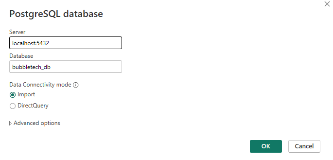
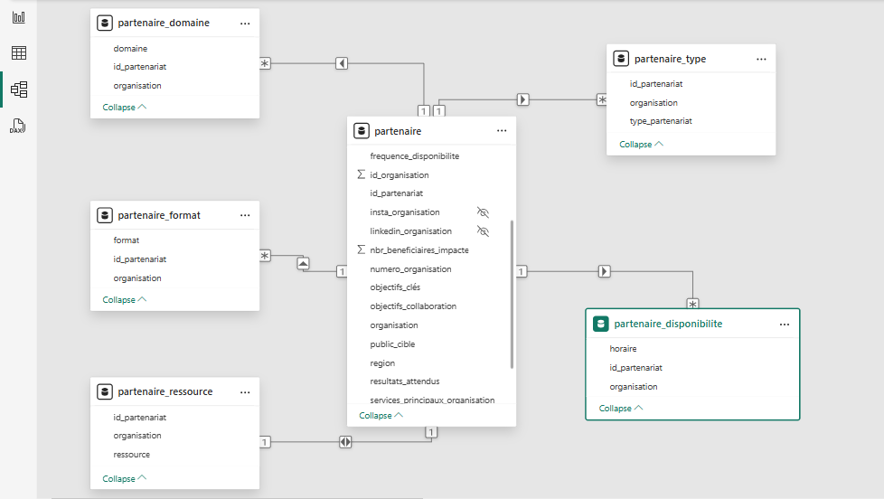

# 📊 Dashboards Power BI – Projet BubbleTech

## 🎯 Objectifs du rapport Power BI

La direction de BubbleTech exprimait un besoin clair : disposer d’une **vision consolidée, fiable et interactive** sur ses activités.

Avant ce projet, les données étaient réparties dans plusieurs fichiers Excel. Il était difficile d’avoir une **vue d’ensemble rapide**, de suivre l’évolution des indicateurs clés, ou de comparer les profils des bénéficiaires.

Le rapport Power BI permet aujourd’hui de :
- Piloter l’activité des stagiaires, bénévoles, formateurs, partenaires,
- Visualiser la répartition des profils et des disponibilités,
- Analyser la satisfaction, les domaines de collaboration, et l’impact des actions,
- Suivre la qualité des données collectées pour assurer la fiabilité des décisions.

En résumé : ce rapport est un **outil d’aide à la décision**, pensé pour la direction, construit à partir de données terrain, et mis à jour en continu pour refléter la réalité de terrain.
---

## 🔗 Connexion à la base de données PostgreSQL

Le rapport Power BI est connecté à une base de données locale PostgreSQL (`localhost:5432`) contenant les vues SQL nécessaires à l’analyse.

La base `bubbletech_db` héberge un ensemble de vues préconstruites (ex. `vue_stagiaire`, `vue_partenaire`, `vue_satisfaction_globale`, etc.), déjà nettoyées, structurées, et prêtes à l’usage.

🛠️ Le mode de connexion utilisé est **Import**, ce qui permet de charger les données localement pour assurer des performances fluides, sans latence au filtrage ni à l’interaction.

📸 Exemple de connexion Power BI :

💡 Ce choix permet une **séparation claire des responsabilités** :
- Le nettoyage et la structuration sont faits en amont, dans la base,
- Power BI se concentre uniquement sur la modélisation, les mesures DAX, et la visualisation.

  ---
  ## 🧩 Modèle relationnel Power BI

Le modèle Power BI repose entièrement sur des **vues SQL thématiques**, conçues pour simplifier la structure métier tout en gardant la logique relationnelle.

🎯 Objectifs du modèle :
- Isoler les rôles (stagiaire, formateur, etc.) dans des vues dédiées,
- Éviter les jointures complexes dans Power BI,
- Clarifier les relations entre identités, disponibilités, formations, et préférences.

📸 Exemple de modèle relationnel (extrait Partenariat) :

Ce découpage par vue permet :
- Une **clarté visuelle** dans le modèle Power BI
- Une **performance optimisée** (moins de relations croisées)
- Une meilleure maintenance du modèle (si une vue change, pas tout le modèle)

✅ Ce modèle rend le travail sur les visuels et les filtres **intuitif et fiable**.

